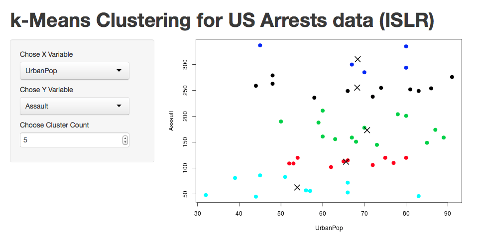
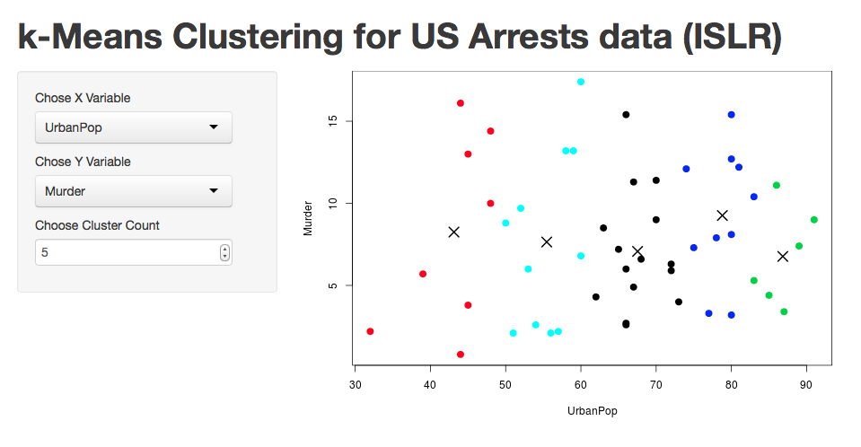

## k-Means CLustering Analysis

* The Data set USArrests from the ISLR package is used for a simple k-Mean Cluster Analysis
* The data is taken from examples used for k-Means luster analysis in 
    Introduction to statistical Learning with R
* There are 5 variables 1) Number of Murders (Murders) 2) Number of Assualts (Assults) 
    3) numbers of rapes (rapes) all pr 100,000 residents in all 50 states in 1973 
    as well as 4) the percent of the population living in urban areas

--- 

## Starting App

* Starting The App:  

* Simply chose a variable for the X axis (UrbanPop is the ideal X variable) 
    and a veriable for the Y Axis

--- 

## Compare variables 

* Compare variables to find clusters:  
</img>

--- 

## Compare different Y variables 

* Compare other variables to find clusters:  
</img>

---

## Vary the number of clusters 

* Finally, chose difernt cluster sizes to find the best fit:  
</img>

---

#That's all

* That's all their is to it! 
* Data and examples from Introduction to Statistical Learning with R. 
    Data taken from the ISLR Package. http://www-bcf.usc.edu/~gareth/ISL/
* The data documentation can be found at
    http://stat.ethz.ch/R-manual/R-patched/library/datasets/html/USArrests.html

